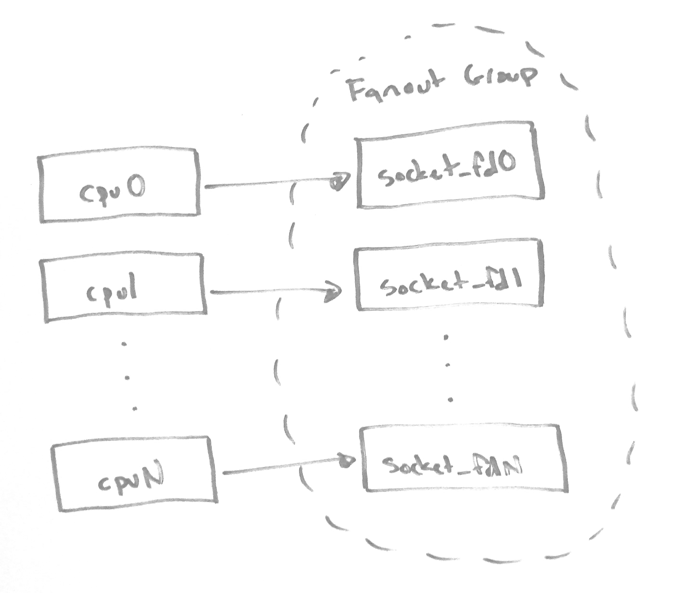
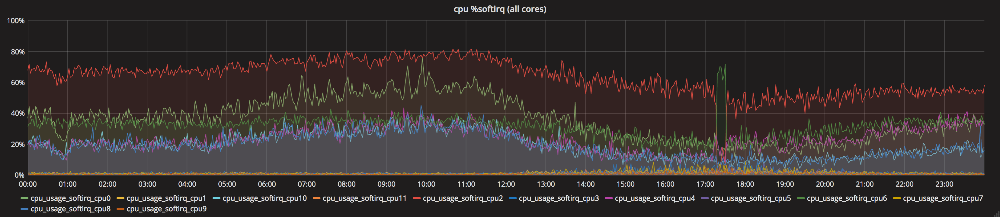
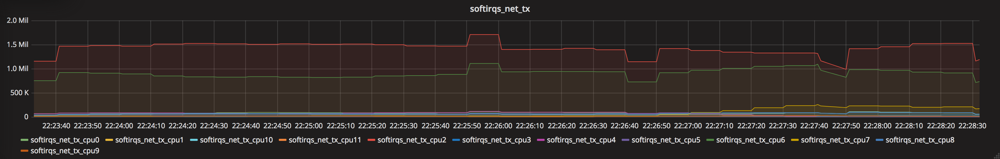

# Per-cpu Packet Captures with rxtxcpu

Running a platform of secure edge services leads to a lot of packets. Prompt and efficient packet handling is key for our environment. Untuned nic drivers and networking stacks generally result in substandard performance for the specialized workloads we run. Disproportionate hardware selections can create unnecessary bottlenecks and leave resources stranded. We therefore invest in understanding the hardware, drivers, networking stacks, packet acceleration frameworks, and tunables available.

This understanding equips us to build and tune for specific workloads, but it isn't a static thing; current practices are constantly challenged, the next generation of hardware is always in planning or testing, new features and optimizations are sought out habitually. Having a toolbox of solid utils is essential to make testing new hardware, features, optimizations, and even current practices streamlined and consistent.

[rxtxcpu](https://github.com/StackPath/rxtxcpu/) was designed to be a tool in the toolbox. The initial goal for rxtxcpu was to create a flexible util to confirm that various methods of packet/flow to cpu mappings were implemented as we intended (i.e. that the configurations we applied were actually doing what we expected). We think we also ended up with a great tool for learning and troubleshooting.

## rxtxcpu Features Overview

rxtxcpu uses AF_PACKET with PACKET_FANOUT_CPU to access per-cpu packet streams. On exit, it reports per-cpu packet counts. When supplied the necessary options, it writes to per-cpu pcap files.

rxtxcpu includes the following features:
* Exiting after reaching a packet count (`--count`)
* Capturing in a single direction or both (`--direction=DIRECTION`)
* Capturing on a subset of cpus via cpu list or cpu mask (`--cpu-list=CPULIST`, `--cpu-mask=CPUMASK`)
* Enabling promiscuous mode on the interface during capture (`--promiscuous`)
* Packet buffered output when writing pcaps (`--packet-buffered`)
* Writing to per-cpu pcap files (`--write=FILE`)
* Writing a pcap to standard out when capturing on a single cpu (`--write=-`)
* Compatibility with offline cpus, including state changes during capture

## rxtxcpu and Packet/Flow Steering

There are several concepts related to mapping packets/flows to cpus. These include RSS (Receive-Side Scaling), RPS (Receive Packet Steering), RFS (Receive Flow Steering), the rx flow hash algorithm, and the rx flow hash indirection table. If you're interested in learning more on RSS, RPS, RFS, or rx flow hash tunables, see the [networking/scaling.txt](https://github.com/torvalds/linux/blob/v4.18/Documentation/networking/scaling.txt) kernel doc.

AF_PACKET hooks into the receive networking stack at a higher level than RSS, RPS, RFS, and rx flow hash tunables. rxtxcpu can be used to validate that packets/flows are ending up on the expected cpu after these processes have taken place.

There are also several concepts related to mapping flows as they are passed from kernel space to user space. These include SO_INCOMING_CPU, SO_ATTACH_REUSEPORT_CBPF, and SO_ATTACH_REUSEPORT_EBPF. If you're interested in learning more on SO_ATTACH_REUSEPORT_CBPF or SO_ATTACH_REUSEPORT_EBPF, see the [reuseport_bpf.c](https://github.com/torvalds/linux/blob/v4.18/tools/testing/selftests/net/reuseport_bpf.c) kernel test.

AF_PACKET hooks into the receive networking stack at a lower level than traditional kernel-to-user-space packet hand-off. rxtxcpu can be used to discover which cpu a flow is expected on when using SO_INCOMING_CPU, SO_ATTACH_REUSEPORT_CBPF, or SO_ATTACH_REUSEPORT_EBPF.

rxtxcpu can also be used to view packets/flows in the transmit networking stack. It can be interesting to see how the different packets which make up a flow are scheduled. For example, packets originating in user space and packets originating in kernel space (e.g. tcp ack), even when part of the same flow, may be transmitted by different cpus.

## Our Initial Implementation: AF_PACKET

Per the [networking/packet_mmap.txt](https://github.com/torvalds/linux/blob/v4.18/Documentation/networking/packet_mmap.txt#L583) kernel doc, PACKET_FANOUT_CPU  maps packets to sockets based on the cpu handling a given packet.
>  - PACKET_FANOUT_CPU: schedule to socket by CPU packet arrives on

When using PACKET_FANOUT socket options you link related sockets together by adding them to the same fanout group.

The PACKET_FANOUT_CPU implementation is, at the core, this operation.
```
smp_processor_id() % num;
```
_You can see the code [here](https://github.com/torvalds/linux/blob/v4.18/net/packet/af_packet.c#L1330)._

In other words, the current cpu handling the packet modulo the number of socket fds in our fanout group. As long as we add a number of socket fds equal to our number of cpus and keep them aligned, we end up with mappings like this.



Our packets flow from each cpu to the associated socket fd; each socket fd can be used to access the packet stream for the associated cpu.

In addition to AF_PACKET, tools like SystemTap and XDP can be used for per-cpu rx (and probably tx) packet counts ([xdp_rxq_info_kern.c](https://github.com/torvalds/linux/blob/v4.18/samples/bpf/xdp_rxq_info_kern.c) / [xdp_rxq_info_user.c](https://github.com/torvalds/linux/blob/v4.18/samples/bpf/xdp_rxq_info_user.c)). It seems likely SystemTap and XDP could support per-cpu packet captures without requiring many, if any, additional features ([xdp_tcpdump_kern.c](https://github.com/netoptimizer/prototype-kernel/blob/6b2a123f33dea2a196ae348fd14a04457746c448/kernel/samples/bpf/xdp_tcpdump_kern.c) / [xdp_tcpdump_user.c](https://github.com/netoptimizer/prototype-kernel/blob/6b2a123f33dea2a196ae348fd14a04457746c448/kernel/samples/bpf/xdp_tcpdump_user.c)). In fact, we plan to extend rxtxcpu with XDP support, in addition to the existing AF_PACKET implementation, since XDP hooks in at a lower level. This should give us another interesting view of packet/flow mappings.

However, AF_PACKET seemed like the best place to start. PACKET_FANOUT_CPU has been around since linux 3.1, so we can support many kernel versions right out of the gate. Installation doesn't require potentially complex or heavy prerequisites (e.g. the debuginfos needed by SystemTap). Simple installation and use are foundational to the project, so AF_PACKET was preferred for the initial implementation over other methods.

## rxtxcpu Helps Diagnose a Production Issue: A War Story

The initial motivation for rxtxcpu was validating packet/flow to cpu mappings while testing various hardware, software, and tuning setups in a controlled lab environment. However, it has already assisted with troubleshooting a production issue.

As mentioned previously, we process a lot of packets. %softirq is one key indicator of performance and efficiency. We recently had systems entering a state, after hours or sometimes days of stable uptime, where %softirq would increase irrelative to pps (packets per second) on one or more cpus.



A quick look at Grafana and we saw NET_TX softirqs had gone up drastically on those same cpus. NET_TX and %softirq stayed elevated on these cpus even after production traffic was removed from the affected system.



An rxtxcpu capture clearly showed at least one packet rapidly repeating in the transmit stack on each of the bad-state cpus.

```
$ sudo timeout -s SIGINT 120 ./txcpu -p -w  ~/eth0.txcpu.pcap eth0

1245050 packets captured on cpu0.
12840 packets captured on cpu1.
837495 packets captured on cpu2.
8979 packets captured on cpu3.
769046 packets captured on cpu4.
11105 packets captured on cpu5.
584811 packets captured on cpu6.
18007 packets captured on cpu7.
758281 packets captured on cpu8.
13076 packets captured on cpu9.
583538 packets captured on cpu10.
8874 packets captured on cpu11.
4845939 packets captured total.
```
```
$ tcpdump -Snnr eth0.txcpu-2.pcap src host 122.0.0.0
reading from file eth0.txcpu-2.pcap, link-type EN10MB (Ethernet)
18:55:23.000000 IP 122.0.0.0.54517 > 205.0.0.0.80: Flags [.], ack 3787879787, win 6551, length 0
18:55:23.000000 IP 122.0.0.0.54517 > 205.0.0.0.80: Flags [.], ack 3787879787, win 6551, length 0
18:55:23.000000 IP 122.0.0.0.54517 > 205.0.0.0.80: Flags [.], ack 3787879787, win 6551, length 0
18:55:23.000000 IP 122.0.0.0.54517 > 205.0.0.0.80: Flags [.], ack 3787879787, win 6551, length 0
18:55:23.000000 IP 122.0.0.0.54517 > 205.0.0.0.80: Flags [.], ack 3787879787, win 6551, length 0
18:55:23.000000 IP 122.0.0.0.54517 > 205.0.0.0.80: Flags [.], ack 3787879787, win 6551, length 0
18:55:23.000000 IP 122.0.0.0.54517 > 205.0.0.0.80: Flags [.], ack 3787879787, win 6551, length 0
18:55:23.000000 IP 122.0.0.0.54517 > 205.0.0.0.80: Flags [.], ack 3787879787, win 6551, length 0
18:55:23.000000 IP 122.0.0.0.54517 > 205.0.0.0.80: Flags [.], ack 3787879787, win 6551, length 0
18:55:23.000000 IP 122.0.0.0.54517 > 205.0.0.0.80: Flags [.], ack 3787879787, win 6551, length 0
...
```
_IPs have been obfuscated to respect privacy._

Being able to compare the packet captures between well-behaved and misbehaving cpus made it trivial to spot these "stuck" tx packets. Knowing the stuck tx packets were only on the misbehaving cpus also increased our confidence that they were indeed the cause of the elevated NET_TX and %softirq.

These stuck tx packets were pending transmission, but the nic driver was not writing them out. We worked closely with the nic vendor and in short time had the driver patched and the issue resolved.

## Final Thoughts

As mentioned above, we plan to extend rxtxcpu with XDP-based packet streams at some point, likely implemented as a runtime option toggling between XDP and AF_PACKET.

We also have another, similar util in the works, rxqueue (which, as the name suggests, has similar features to rxtxcpu, but works with per-queue packet streams). The initial implementation using netmap is past the proof-of-concept stage, but is not yet release ready. We plan to extend rxqueue with XDP-based packet streams after initial release as well (xdp_rxq_info should accomplish this nicely).

rxtxcpu is a fun little util which can be used to view packet/flow to cpu mappings, for troubleshooting, or simply for learning purposes. It was built with flexibility in mind and to do one thing and do it well. Now that we've covered how it works, feel free to give it a whirl.
